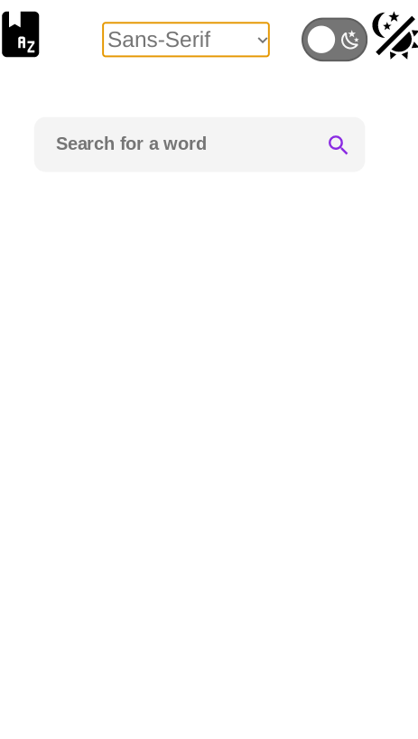
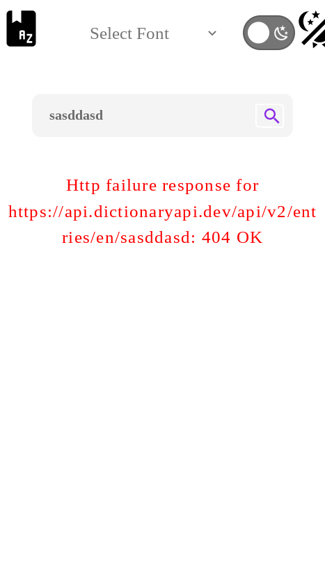
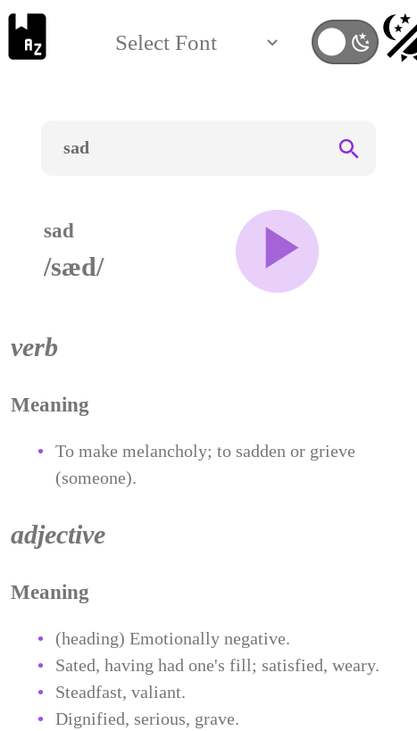
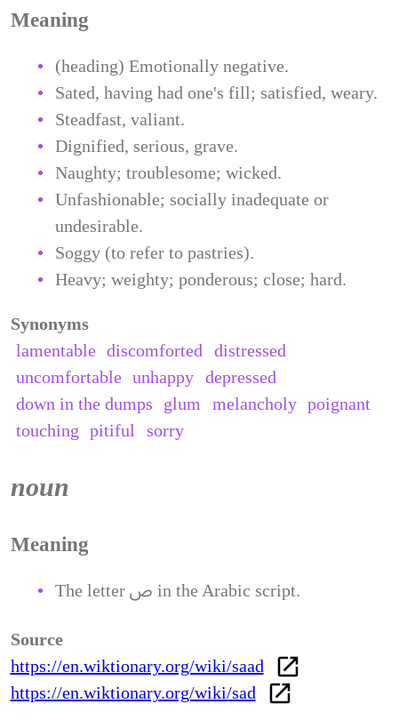
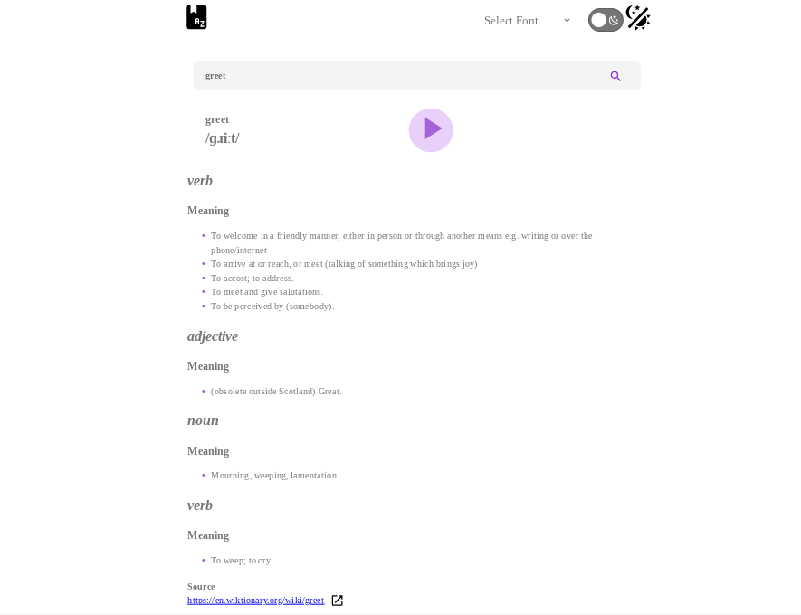
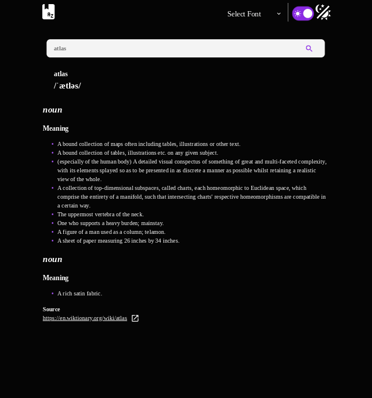

# Angular Dictionary App

Angular conversion of my [React Dictionary App](https://github.com/jdegand/dictionary-app).

## Table of contents

- [Overview](#overview)
  - [Screenshots](#screenshots)
- [My process](#my-process)
  - [Built with](#built-with)
  - [Thoughts](#thoughts)
  - [API Bug](#api-bug)
  - [Useful Resources](#useful-resources)

## Overview

### Screenshots


***



***


***



***





***



***



***

## My process

### Built with

- [Angular](https://angular.io)
- [Angular CLI](https://github.com/angular/angular-cli) version 16.0.1.
- [Dictionary Api](https://dictionaryapi.dev/)

## Thoughts

- Used this project as a basis to test new Angular 16 features
- Used standalone components for everything and even removed app.module and changed main.ts to bootstrap the application
- Not really gonna be errors on the searchForm - submission is prevented if the input is empty
- You can type the word in the input or just change the query parameter value 
- pneumonoultramicroscopicsilicovolcanoconiosis - maxLength for search input 
- Many different ways to get make api request - thought about using state and passing the result of the query to word-details component,
I could not have included router at all like I did in my React implementation,  different implementation of router, etc.
- Added a router link on the book icon to go back to the home page - missing from my react implementation
- Used long words to test the play and pause functionality
- Showing an error when the observable failed was difficult to figure out and required some trial and error
- Using an async pipe with first and last - made it difficult to know if I could use an else statement as well
- Important to remember, not to use # on ng-template when passing an else reference
- Navigating back to the homepage does not clear the input value of the search form - possible to use ngOnInit in app component to reset it ? 
- Had issue with select option font color matching the option's background (could only see option text when cycling thru them) with dark mode 

## Api Bug 

The word 'greet' has incorrectly formatted json.  This changed my [word-details](src/app/word-details/word-details.component.html) implementation.

```json
[
  {
    "word": "greet",
    "phonetic": "/ɡɹiːt/",
    "phonetics": [
      {
        "text": "/ɡɹiːt/",
        "audio": "https://api.dictionaryapi.dev/media/pronunciations/en/greet-us.mp3",
        "sourceUrl": "https://commons.wikimedia.org/w/index.php?curid=2650995",
        "license": {
          "name": "BY-SA 3.0",
          "url": "https://creativecommons.org/licenses/by-sa/3.0"
        }
      }
    ],
    "meanings": [
      {
        "partOfSpeech": "verb",
        "definitions": [
          {
            "definition": "To welcome in a friendly manner, either in person or through another means e.g. writing or over the phone/internet",
            "synonyms": [
              
            ],
            "antonyms": [
              
            ]
          },
          {
            "definition": "To arrive at or reach, or meet (talking of something which brings joy)",
            "synonyms": [
              
            ],
            "antonyms": [
              
            ]
          },
          {
            "definition": "To accost; to address.",
            "synonyms": [
              
            ],
            "antonyms": [
              
            ]
          },
          {
            "definition": "To meet and give salutations.",
            "synonyms": [
              
            ],
            "antonyms": [
              
            ]
          },
          {
            "definition": "To be perceived by (somebody).",
            "synonyms": [
              
            ],
            "antonyms": [
              
            ],
            "example": "A brilliant dawn greeted her eyes as she looked out of the window."
          }
        ],
        "synonyms": [
          
        ],
        "antonyms": [
          
        ]
      }
    ],
    "license": {
      "name": "CC BY-SA 3.0",
      "url": "https://creativecommons.org/licenses/by-sa/3.0"
    },
    "sourceUrls": [
      "https://en.wiktionary.org/wiki/greet"
    ]
  },
  {
    "word": "greet",
    "phonetic": "/ɡɹiːt/",
    "phonetics": [
      {
        "text": "/ɡɹiːt/",
        "audio": "https://api.dictionaryapi.dev/media/pronunciations/en/greet-us.mp3",
        "sourceUrl": "https://commons.wikimedia.org/w/index.php?curid=2650995",
        "license": {
          "name": "BY-SA 3.0",
          "url": "https://creativecommons.org/licenses/by-sa/3.0"
        }
      }
    ],
    "meanings": [
      {
        "partOfSpeech": "adjective",
        "definitions": [
          {
            "definition": "(obsolete outside Scotland) Great.",
            "synonyms": [
              
            ],
            "antonyms": [
              
            ]
          }
        ],
        "synonyms": [
          
        ],
        "antonyms": [
          
        ]
      }
    ],
    "license": {
      "name": "CC BY-SA 3.0",
      "url": "https://creativecommons.org/licenses/by-sa/3.0"
    },
    "sourceUrls": [
      "https://en.wiktionary.org/wiki/greet"
    ]
  },
  {
    "word": "greet",
    "phonetic": "/ɡɹiːt/",
    "phonetics": [
      {
        "text": "/ɡɹiːt/",
        "audio": "https://api.dictionaryapi.dev/media/pronunciations/en/greet-us.mp3",
        "sourceUrl": "https://commons.wikimedia.org/w/index.php?curid=2650995",
        "license": {
          "name": "BY-SA 3.0",
          "url": "https://creativecommons.org/licenses/by-sa/3.0"
        }
      }
    ],
    "meanings": [
      {
        "partOfSpeech": "noun",
        "definitions": [
          {
            "definition": "Mourning, weeping, lamentation.",
            "synonyms": [
              
            ],
            "antonyms": [
              
            ]
          }
        ],
        "synonyms": [
          
        ],
        "antonyms": [
          
        ]
      },
      {
        "partOfSpeech": "verb",
        "definitions": [
          {
            "definition": "To weep; to cry.",
            "synonyms": [
              
            ],
            "antonyms": [
              
            ]
          }
        ],
        "synonyms": [
          
        ],
        "antonyms": [
          
        ]
      }
    ],
    "license": {
      "name": "CC BY-SA 3.0",
      "url": "https://creativecommons.org/licenses/by-sa/3.0"
    },
    "sourceUrls": [
      "https://en.wiktionary.org/wiki/greet"
    ]
  }
]
```

## Useful Resources

- [Stack Blitz](https://stackblitz.com/edit/github-e6mv2z?file=src%2Fapp%2Fapp.component.ts) - Change font-family dynamically
- [Stack Blitz](https://stackblitz.com/edit/angular-dark-mode-example?file=src%2Fapp%2Fdark-mode-toggle%2Fdark-mode-toggle.component.ts) - dark mode toggle component
- [YouTube](https://www.youtube.com/watch?v=8PItOt2wiz0) - Template Driven Form in Angular | Angular Forms | Angular 13+
- [Stack Overflow](https://stackoverflow.com/questions/35978450/angular-2-dropdown-options-default-value) - options default value
- [Medium](https://blog.angulartraining.com/how-to-implement-a-dark-theme-with-css-and-angular-2cfd98b9455d) - dark theme angular
- [Medium](https://medium.com/ngconf/how-to-inject-document-in-angular-7d17804430b6) - inject document
- [Stack Overflow](https://stackoverflow.com/questions/15040297/clear-element-classlist) - clear element classlist
- [Offering Solutions](https://offering.solutions/blog/articles/2023/02/11/migrating-to-angular-standalone-components/) - migrating to angular standalone components
- [YouTube](https://www.youtube.com/watch?v=G381Q_nmnZM) - Search Forms with Angular and Spring Boot
- [AngularJS Wiki](https://www.angularjswiki.com/angular/get-query-parameters-in-angular/) - get query parameters
- [Stack Overflow](https://stackoverflow.com/questions/52317494/is-it-good-to-call-subscribe-inside-subscribe) - subscribe inside subscribe anti-pattern
- [Medium](https://benlesh.medium.com/rxjs-observable-interop-with-promises-and-async-await-bebb05306875) - rxjs observable interop with promises and async await
- [YouTube](https://www.youtube.com/watch?v=l5jARPyOlkM) - Angular Async Pipe - Learn the Main Advantages
- [Stack Overflow](https://stackoverflow.com/questions/44226380/angular-2-get-value-from-url-with-promise-and-await) - get value from url with promise and await
- [CodeBurst](https://codeburst.io/understanding-resolvers-in-angular-736e9db71267) - understanding resolvers
- [Beyond Java](https://www.beyondjava.net/angular-async-await) - angular async await
- [Stack Overflow](https://stackoverflow.com/questions/37771855/chaining-observables-in-rxjs) - chaining observables in rxjs
- [Stack Overflow](https://stackoverflow.com/questions/73096964/how-to-refactor-nested-subscription-in-angular) - refactor nested subscription in angular
- [Medium](https://blog.bitsrc.io/6-ways-to-unsubscribe-from-observables-in-angular-ab912819a78f) - unsubscribe from observables
- [Stack Overflow](https://stackoverflow.com/questions/37818677/how-can-i-limit-ngfor-repeat-to-some-number-of-items-in-angular) - limit ngFor repeat
- [Stack Overflow](https://stackoverflow.com/questions/50500706/how-to-display-certain-items-first-in-angular-ngfor) - display certain items first in angular ngFor
- [Stack Overflow](https://stackoverflow.com/questions/66416945/how-to-get-1st-true-value-for-ngif-inside-ngfor) - first true value in ngFor
- [Stack Overflow](https://stackoverflow.com/questions/38057537/how-to-check-the-length-of-an-observable-array) - check the length of observable array
- [Stack Overflow](https://stackoverflow.com/questions/43712445/how-to-pass-object-as-component-input-in-ngfor) - pass object as component input
- [Berlitz](https://www.berlitz.com/blog/longest-word-english#:~:text=Pneumonoultramicroscopicsilicovolcanoconiosis%20meaning&text=Pneumonoultramicroscopicsilicovolcanoconiosis%20is%20a%20string%20of,term%20inhalation%20of%20silica%20dust.) - longest english words
- [Github](https://github.com/mgechev/ngx-circular-player/blob/master/projects/ngx-circular-player/src/lib/ngx-circular-player.component.ts) - ngx circular player component
- [Stack Overflow](https://stackoverflow.com/questions/35269179/angular-conditional-class-with-ngclass) - angular conditional class with ngclass
- [Stack Overflow](https://stackoverflow.com/questions/37051496/combine-ngstyle-with-condition-if-else) - ngstyle with condition
- [Elite Ionic](https://eliteionic.com/tutorials/handle-errors-reactively-when-using-async-pipe/) - handle errors reactively when using async pipe
- [YouTube](https://www.youtube.com/watch?v=TF4rnbptfRo) - 12. Testing with jest and angular
- [Blog](https://sebastian-holstein.de/post/2018-02-26-error-handling-angular/) - error handling angular
- [Coding Latte](https://codinglatte.com/posts/angular/angular-async-pipe-handle-errors/) - async pipe handle errors
- [Stack Overflow](https://stackoverflow.com/questions/33783967/rxjs-observable-doesnt-complete-when-an-error-occurs) - rxjs observable doesn't complete when an error occurs
- [Stack Overflow](https://stackoverflow.com/questions/62567799/angular-9-rxjs-how-to-handle-an-error-thrown-inside-switchmap) - rxjs how to handle an error thrown inside switchMap
- [Angular University](https://blog.angular-university.io/rxjs-error-handling/) - rxjs error handling
- [Stack Overflow](https://stackoverflow.com/questions/12836227/change-select-box-option-background-color) - change select box option background color
